# JavaLin / JaveX

Java N-dimensional array library with a target architecture designed for performance evolution: scalar -> SIMD -> native/GPU backends.

This repository documents and incrementally implements a two-axis design:
- **dtype axis**: `NDArray<T>` + typed arrays (`F64Array`, `F32Array`, `I32Array`, `I64Array`)
- **backend axis**: per-dtype operators selected by an ops provider (scalar first, SIMD/native later)

> Status: this README describes an **initial design direction**. The project is **not implemented yet**, several modules are placeholders, and full implementation may not happen soon.

## Why This Design

The core memory model is a flat primitive array plus index mapping metadata:

`flatIndex = offset + sum(i_k * stride_k)`

- **Shape** describes logical dimensions
- **Strides** describe physical memory stepping
- **Offset** enables zero-copy views

This unlocks efficient views (transpose/slice/reverse) by editing metadata instead of copying data.

## Architecture Map



Design notes and rationale are available in `Docx/ndarray_design_v5.docx`.

## Architecture (Target)

### 1) Core layer (`Core`)

Foundation contracts and shared semantics:
- `NdArray<T>`: abstract base for shape/stride/index logic
- `DType`: dtype token model
- `OpsProvider`: backend/operator resolver SPI

Design rule: core should not depend on higher layers.

### 2) Array layer (`Array`)

Typed concrete arrays that own primitive storage and delegate math:
- `F64Array` -> `double[]`
- `F32Array` -> `float[]`
- `I32Array` -> `int[]`
- `I64Array` -> `long[]`
- `NdArrays`: factory helpers

### 3) Operators layer (`Operators`)

Per-dtype computation contracts + implementations:
- Interfaces: `F64Operator`, `F32Operator`, `I32Operator`, `I64Operator`
- Implementations organized under per-dtype subpackages
- Intended backend progression: scalar baseline -> SIMD -> parallel/native

### 4) Expression layer (`Expression`)

Expression graph and fluent-building surface:
- `ExpressionBuilder`
- expression nodes in `Expression/Nodes`

This layer should depend on lower layers, not vice versa.

## Key Design Decisions

- **Primitive backing arrays, not boxed `Object[]`** for cache locality and throughput.
- **Generic API with dtype discipline** at call sites, while allowing specialized primitive internals.
- **Shared shape/stride logic once** in abstract base, type-specific compute in operators.
- **Contiguity-aware compute path** (fast-path contiguous views; fallback for strided views).
- **Startup-time backend selection** via provider pattern to keep hot paths monomorphic.

## Performance Roadmap

Planned optimization layers (composable):
1. Correct scalar operators (baseline)
2. Cache-aware kernels (especially matmul tiling)
3. SIMD via Java Vector API (`jdk.incubator.vector`)
4. Multithreading for large workloads
5. Optional JNI/Panama/native BLAS/CUDA backends

For element-wise ops, memory bandwidth is often the practical ceiling; for matmul, cache tiling and compute reuse dominate.

## Getting Started

### Requirements

- JDK (version as configured by this project)
- Gradle wrapper (`gradlew.bat`) included

If you plan to enable Vector API code paths, you may need incubator flags at compile/runtime depending on your JDK/toolchain setup.

### Build (Windows PowerShell)

```powershell
.\gradlew.bat clean build
```

### Run tests

```powershell
.\gradlew.bat test
```

### Run application entry point

```powershell
.\gradlew.bat run
```

If `run` is not configured in your current Gradle setup, execute `Main` from IDE or add an application plugin/main class config in `build.gradle.kts`.

## Source Layout

- `src/main/java/io/github/youssefrashidy/Core` - core abstractions
- `src/main/java/io/github/youssefrashidy/Array` - concrete ndarray types/factories
- `src/main/java/io/github/youssefrashidy/Operators` - operator interfaces and backends
- `src/main/java/io/github/youssefrashidy/Expression` - expression builder and nodes
- `Docx/` - architecture/design documents and diagrams

## Dependency Rules (Intended)

- `Expression` -> `Operators` -> `Array` -> `Core`
- `Core` imports nothing from higher layers
- `NdArray` should not import from expression packages
- `OpsProvider` contract lives in core; implementations live in operators

## Current Scope and Expectations

This repository is currently design-first and pre-implementation.

Recommended contributor expectations:
- treat all architecture notes as draft targets,
- expect API/class changes while design is still settling,
- do not assume production-ready behavior,
- expect long gaps before major implementation milestones.

## Contributing

Contributions are welcome, especially in:
- correctness tests for shape/stride/view semantics
- matmul kernels and tiling strategies
- SIMD backend parity tests against scalar baseline
- expression planning/execution integration

## License

No license file was detected in the current workspace snapshot.
Add a `LICENSE` file before external distribution.
